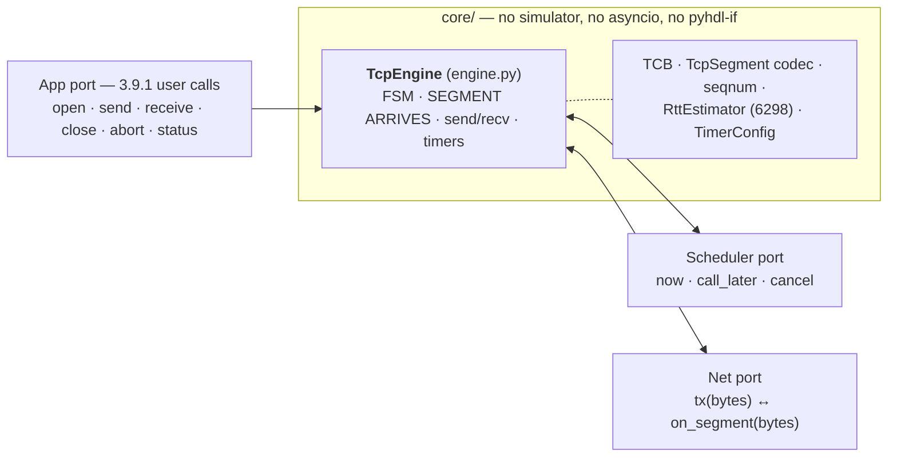
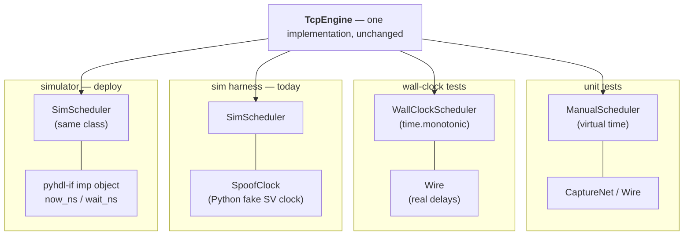
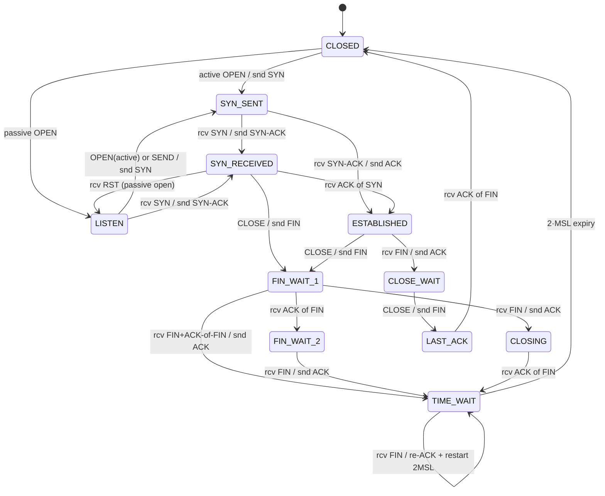
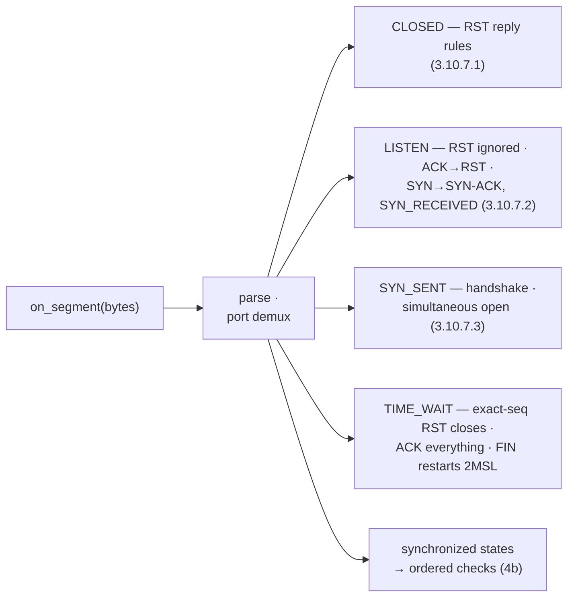
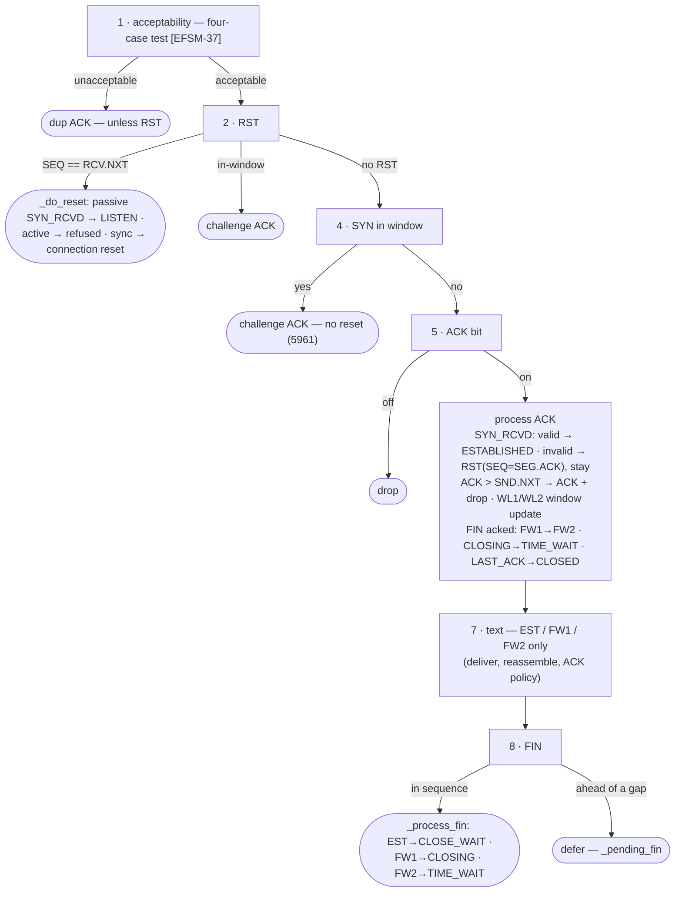
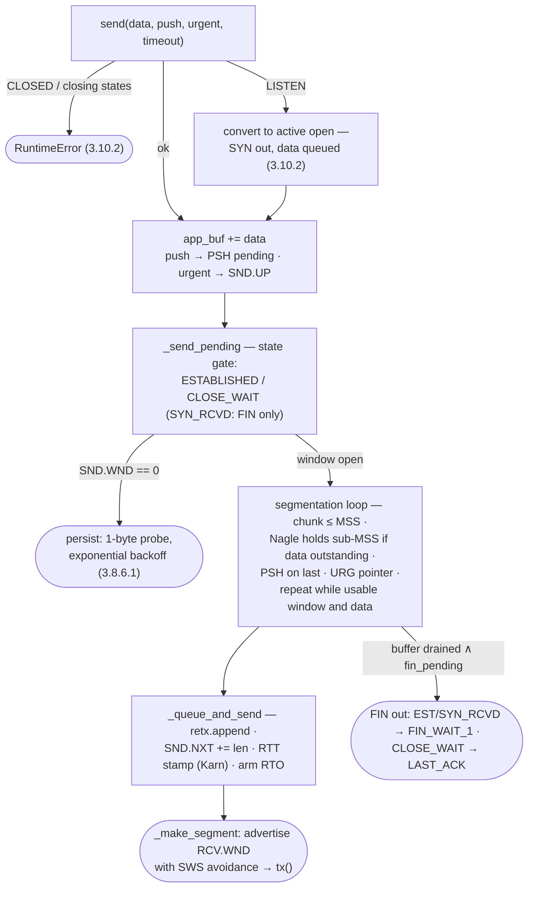
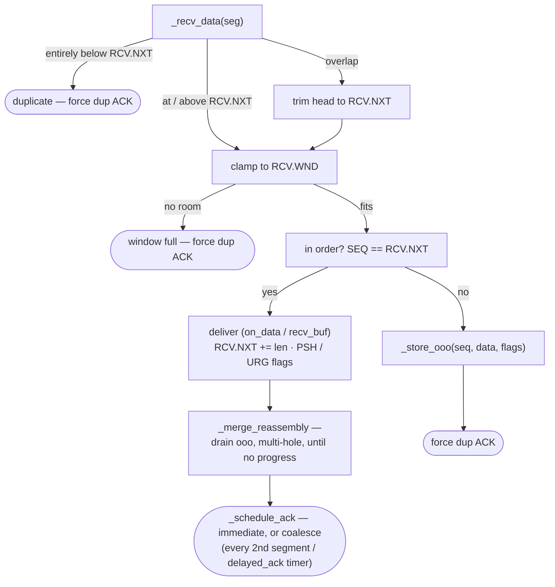
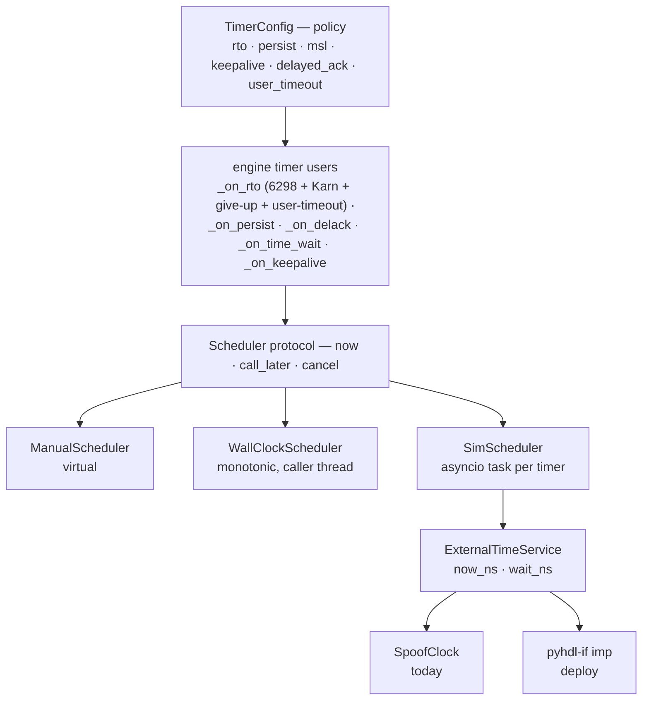
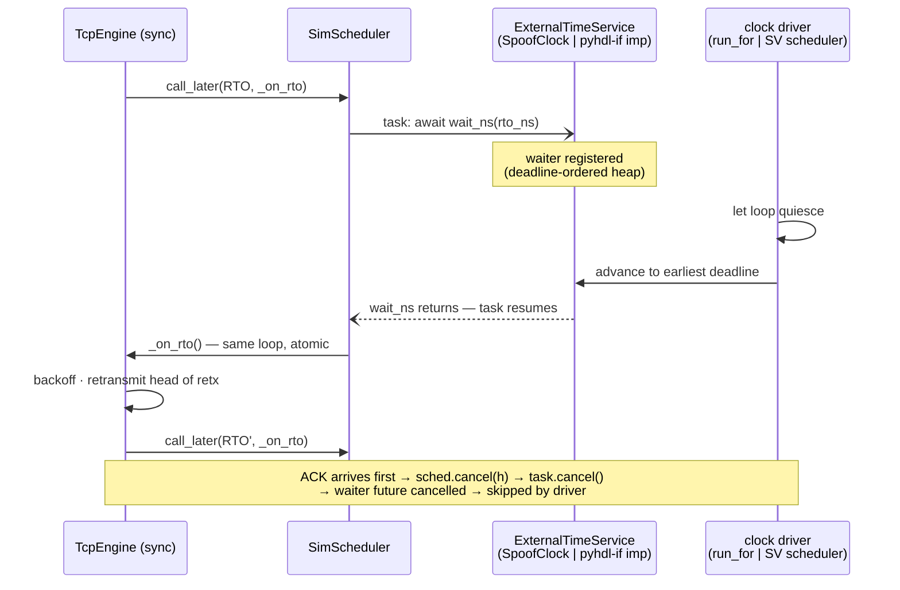

# tcp_model — Architecture Diagrams

Companion to `DOCUMENTATION.md` (sections cited as *doc §n*). Diagrams are
Mermaid; they render on GitHub/GitLab/VS Code. References are to `core/` and
`ports/` at v0.3.0.

---

## 1. Ports-and-adapters view

The engine is synchronous and dependency-free; the world exists only through
three injected ports (*doc §1–2*).

## 2. One engine, four bindings

Same `TcpEngine`, different port bindings per environment (*doc §5, §7*).
The rightmost column is Boundary 2 of the implementation plan; swapping
`SpoofClock` → the pyhdl-if imp object is the only change between the last
two columns.

## 3. Connection FSM

The canonical diagram ([EFSM-0], RFC 9293 3.10) as implemented, plus the one
9293 arc worth drawing: SYN-RECEIVED returning to LISTEN on a RST when the
open was passive. Every arc is a cited test in `test_efsm_paper.py`.

Not drawn (they cross everything, and the RFC's own figure omits them too):
CLOSE/ABORT from LISTEN or SYN-SENT → CLOSED; ABORT with RST from any
synchronized state → CLOSED; exact-`RCV.NXT` RST → CLOSED (SYN-RECEIVED with
an active open reports "connection refused"); in-window RST/SYN → challenge
ACK with **no** transition (RFC 5961); retransmission give-up and user
timeout → CLOSED via `_abort`.

## 4a. SEGMENT ARRIVES — per-state dispatch

`on_segment` fans out by state; the synchronized states continue into the
check chain of §4b.

## 4b. SEGMENT ARRIVES — synchronized-state checks

The RFC's ordered checks as a single spine; every rejection is its own
terminal (3.10.7.4). The handler tail always runs `_check_pending_fin`, which
fires a deferred FIN the moment reassembly reaches it.

## 5. Send path

`send()` through segmentation to the retransmission queue. The segmentation
loop is one node — it repeats while window and data allow.

## 6. Receive path

`_recv_data` + multi-hole reassembly + ACK policy, as a straight spine.

## 7. Timer and clock stack

Policy → users → protocol → implementations → external service. Per-timer
behavior is the table in *doc §5*; the user timeout is a deadline check
inside `_on_rto`, not a scheduled timer.

## 8. External-clock rendezvous (the pyhdl-if seam)

One RTO under `SimScheduler`. Today the service is `SpoofClock` and
`run_for` drives; under the simulator it is the pyhdl-if imp object and the
SV scheduler drives — the engine and `SimScheduler` cannot tell the
difference. Everything executes on the one asyncio loop, so engine entries
stay atomic (*doc §3*).

